```{=html}
<div style="padding: 0.75rem 0 0.4rem 0;">
<h1>Vikesh Dheeriya</h1>
<p style="font-size:1.05rem;">I'm a senior at UCSB studying Hydrologic Science and Policy with a focus on remote sensing, GIS, and water resources. My academic and research experience spans habitat connectivity analysis, satellite data processing, groundwater policy, watershed management, and environmental compliance. Outside of school, I love swimming in the ocean, developing recipes for my cookbook, and playing basketball. Feel free to reach out at <a href="mailto:vikesh@ucsb.edu">vikesh@ucsb.edu</a>.</p>
</div>
```

::: {.panel-tabset}

## Experience

```{=html}
<div class="exp-list">

<div class="exp-item">
<div class="exp-date-col">
  June 2026 – Present
  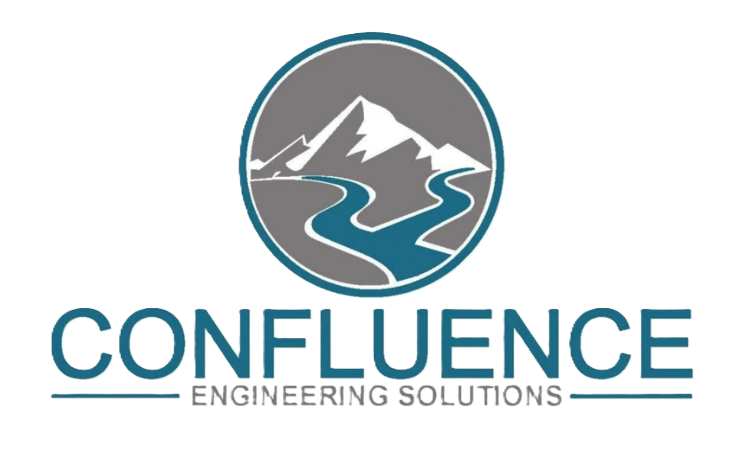
</div>
<div class="exp-body">
<div class="exp-role">Water Resources Intern</div>
<div class="exp-org">Confluence Engineering</div>
<p class="exp-desc">Assisting drinking water, wastewater, and groundwater projects throughout the Central Coast.</p>
</div>
</div>

<div class="exp-item">
<div class="exp-date-col">
  July 2025 – Present
  
</div>
<div class="exp-body">
<div class="exp-role">Research Intern</div>
<div class="exp-org">Earth Research Institute, UCSB</div>
<p class="exp-desc">Developing machine learning models to predict aboveground biomass in grasslands using multi-sensor remote sensing data (Sentinel-1/2, ALOS PALSAR) across the United States.</p>
</div>
</div>

<div class="exp-item">
<div class="exp-date-col">
  July 2024 – October 2025
  <div style="display:flex; gap:0.4rem; flex-wrap:wrap; margin-top:0.5rem;">
    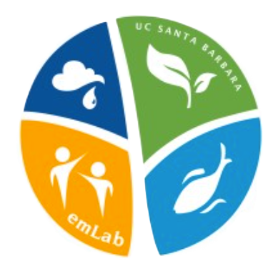
    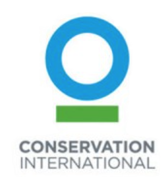
  </div>
</div>
<div class="exp-body">
<div class="exp-role">Environmental Researcher</div>
<div class="exp-org">Environmental Markets Lab &amp; Conservation International</div>
<p class="exp-desc">Modeling elephant connectivity under different climate and socioeconomic land cover scenarios in the Kavango-Zambezi region of Southern Africa.</p>
</div>
</div>
</div>
```

## Education

```{=html}
<div class="edu-block">
<div class="edu-degree">B.S. Hydrologic Science and Policy</div>
<div class="edu-institution">University of California, Santa Barbara</div>
<div class="edu-meta">Expected June 2026 &nbsp;·&nbsp; Honors Program &nbsp;·&nbsp; GPA: 3.67 &nbsp;·&nbsp; Bren-Environmental Studies Fellowship (2023–2025)</div>
<p style="font-size:0.875rem; color:#3a3a3c; margin:0.75rem 0 0.5rem 0;">Relevant coursework:</p>
<div class="edu-courses">
<span class="course-tag">Hydrology</span>
<span class="course-tag">Water Quality</span>
<span class="course-tag">UC Water Academy 2025</span>
<span class="course-tag">Environmental Law</span>
<span class="course-tag">Freshwater Ecology</span>
<span class="course-tag">Soil Science</span>
<span class="course-tag">CEQA Environmental Impact Analysis</span>
<span class="course-tag">GIS for Environmental Applications</span>
<span class="course-tag">Water Resource Management</span>
<span class="course-tag">Advanced Groundwater Analysis</span>
<span class="course-tag">Applied Watershed Management</span>
<span class="course-tag">Quantitative Geomorphology</span>
<span class="course-tag">Water Supply and Demand</span>
<span class="course-tag">Soil Morphology, Genesis, and Classification</span>
</div>
</div>

<div class="photos-grid" style="margin-top: 2rem;">
<figure>
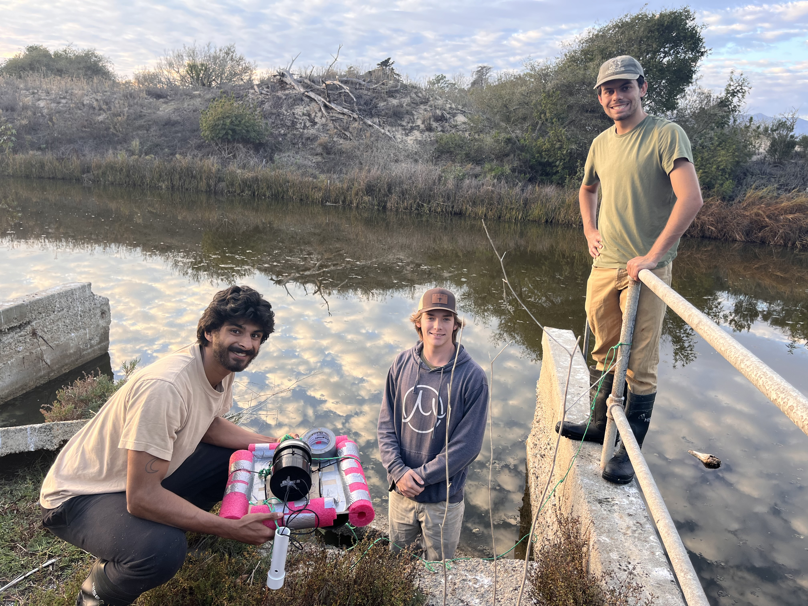
<figcaption>Deploying our homemade water quality sensor to measure pH and temperature in the Devereux Slough</figcaption>
</figure>
<figure>
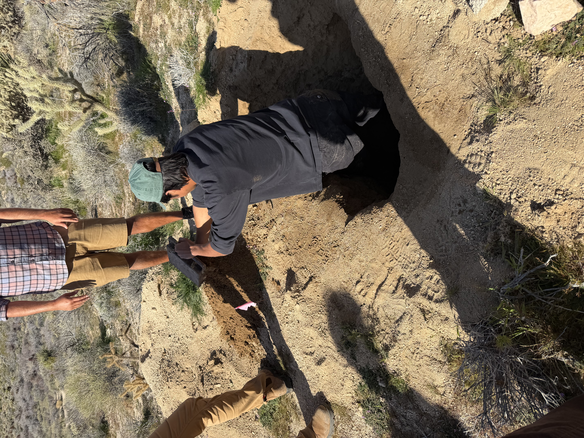
<figcaption>Digging a soil pit in the Mojave Desert</figcaption>
</figure>
<figure>
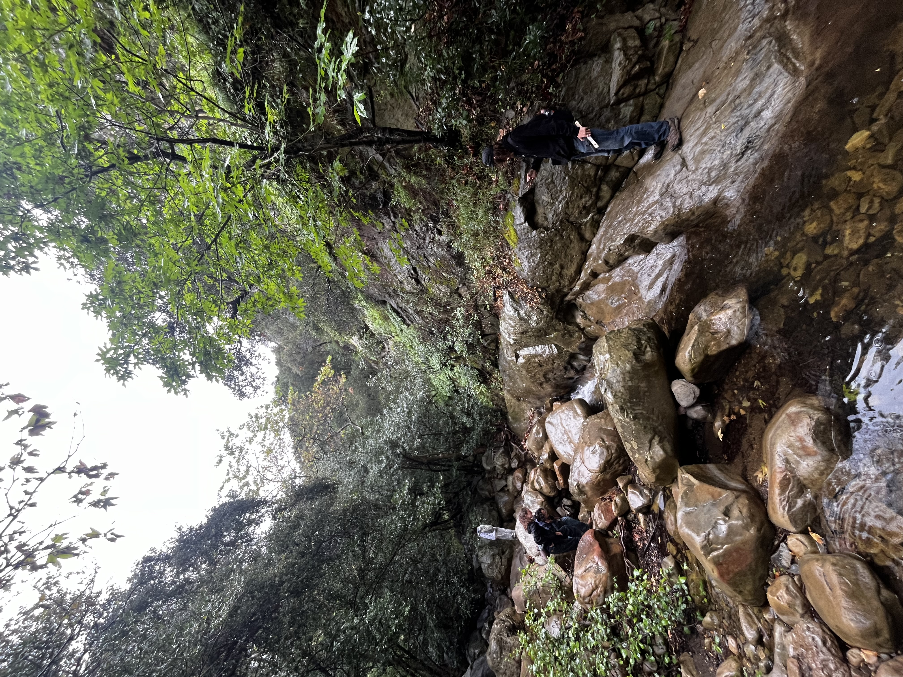
<figcaption>Classifying sediment size distributions in Mission Creek</figcaption>
</figure>
<figure>
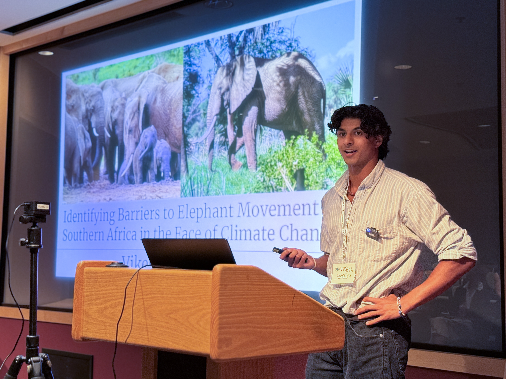
<figcaption>Presenting research on modeling elephant connectivity</figcaption>
</figure>
</div>
```

## Extracurriculars

```{=html}
<div class="extra-item">
<div class="extra-role">Diversity, Equity &amp; Inclusion Coordinator</div>
<div class="extra-org">UCSB Hydrology Club</div>
<div class="extra-date">October 2024 – Present</div>

<div style="display:flex; gap:1.25rem; align-items:flex-start; margin:1rem 0 1.25rem 0;">
  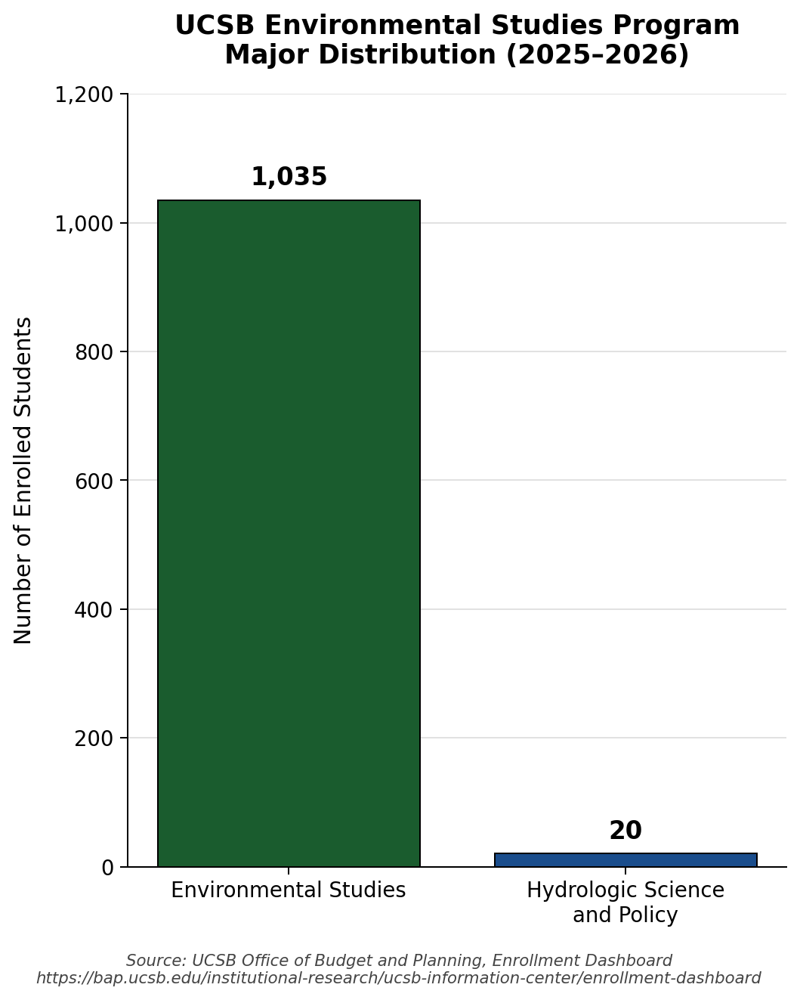
  <div>
    <p class="extra-desc">The UCSB Hydrology Club, founded in 2023, brings together students interested in water-related careers, community projects, networking, and hands-on opportunities to support the next generation of water professionals. Activities include professional networking events, participation in Drill Days, UC Water Academy, and GRA meetings. We also host career panels with industry professionals, field trips, study sessions, grant-writing workshops, and guest lecturers.</p>
    <p class="extra-desc">As DEI Coordinator, I lead outreach to underrepresented students in the environmental sciences. Of the 1,035 students enrolled in Environmental Studies at UCSB, only 20 are enrolled in Hydrologic Science and Policy, a gap the club actively works to close by exposing more environmental science undergraduates to hydrology and bridging industry and academia in the water sector.</p>
  </div>
</div>

<div class="photos-grid">
<figure>

<figcaption>Recruiting students at Club Rush</figcaption>
</figure>
<figure>

<figcaption>First group of undergraduates to attend a GRA Central Coast Branch Meeting</figcaption>
</figure>
<figure>

<figcaption>Attending 2025 Ray Taber Drill Day in Fresno</figcaption>
</figure>
<figure>

<figcaption>Lunch with Darcy Lecturer Dr. Grant Ferguson</figcaption>
</figure>
<figure>

<figcaption>Hydrology club grant-writing workshop</figcaption>
</figure>
</div>
</div>
```

## Cooking

```{=html}
<style>
.food-gallery-grid {
  display: grid;
  grid-template-columns: repeat(3, 1fr);
  gap: 1.2rem;
  max-width: 1150px;
  margin: 0 auto 2.5rem auto;
  justify-items: center;
}
.food-photo-tile {
  position: relative;
  width: 100%;
  max-width: 340px;
  aspect-ratio: 1/1;
  overflow: hidden;
  border-radius: 1.3rem;
  box-shadow: 0 2px 16px rgba(20,90,50,0.12);
  background: #fff;
  cursor: pointer;
  transition: box-shadow .18s;
  margin: 0;
}
.food-photo-tile:hover {
  box-shadow: 0 10px 36px rgba(20,90,50,0.19);
  z-index: 2;
}
.food-photo-tile img {
  width: 100%;
  height: 100%;
  object-fit: cover;
  transition: transform .23s;
}
.food-photo-tile:hover img {
  transform: scale(1.09) rotate(-1.5deg);
}
.food-photo-caption {
  position: absolute;
  bottom: 0; left: 0; right: 0;
  background: rgba(255,255,255,0.82);
  color: #0C2B1A;
  font-weight: 500;
  padding: .35em .7em .38em .7em;
  font-size: 0.86em;
  text-align: center;
  opacity: 0;
  transition: opacity .15s;
  border-radius: 0 0 1.3rem 1.3rem;
}
.food-photo-tile:hover .food-photo-caption {
  opacity: 1;
}
@media (max-width: 1200px) {
  .food-gallery-grid { grid-template-columns: repeat(2, 1fr); }
}
@media (max-width: 800px) {
  .food-gallery-grid { grid-template-columns: 1fr; }
  .food-photo-tile { max-width: 99vw; }
}
.vv-center {
  display: flex;
  flex-direction: column;
  align-items: center;
  width: 100%;
}
.vv-title {
  font-family: 'Lato', sans-serif;
  font-weight: 300;
  font-size: 3rem;
  color: #1a2b4d;
  text-align: center;
  margin-bottom: 1rem;
}
.vv-blurb {
  max-width: 640px;
  text-align: center;
  margin: 0 auto 2rem auto;
  font-size: 0.9rem;
  line-height: 1.7;
  color: #2c3e50;
}
.vv-blurb a {
  color: var(--accent);
  text-decoration: none;
}
.vv-blurb a:hover { text-decoration: underline; }
.vv-refs {
  max-width: 640px;
  margin: 0 auto 2rem auto;
  font-size: 0.75rem;
  color: #2c3e50;
  line-height: 1.6;
}
.vv-refs a { color: var(--accent); }
</style>

<div class="vv-center">
<div class="vv-title">viks veggies</div>
<div class="vv-blurb">
  A plant-based cooking page to promote sustainable eating habits that help reduce
  <a href="https://doi.org/10.1126/science.aaq0216" target="_blank">water consumption and land use</a><sup>[1]</sup>,
  risk of <a href="https://doi.org/10.1161/JAHA.119.012865" target="_blank">cardiovascular disease</a><sup>[2]</sup>,
  and other <a href="https://doi.org/10.1080/10408398.2016.1138447" target="_blank">chronic health conditions</a><sup>[3]</sup>.
  Reach out if you want the recipe for any of these dishes or if you have any questions!
</div>

<div class="food-gallery-grid">
  <div class="food-photo-tile">
    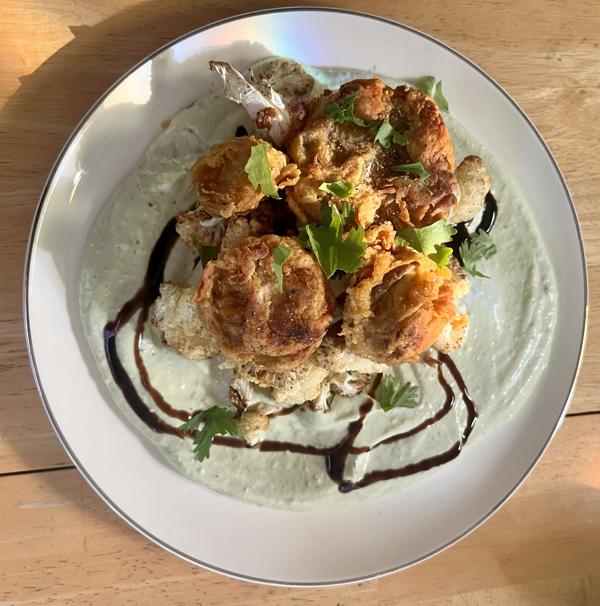
    <div class="food-photo-caption">crispy mushrooms, tofu ricotta, balsamic glaze</div>
  </div>
  <div class="food-photo-tile">
    
    <div class="food-photo-caption">shoyu ramen, seitan chashu</div>
  </div>
  <div class="food-photo-tile">
    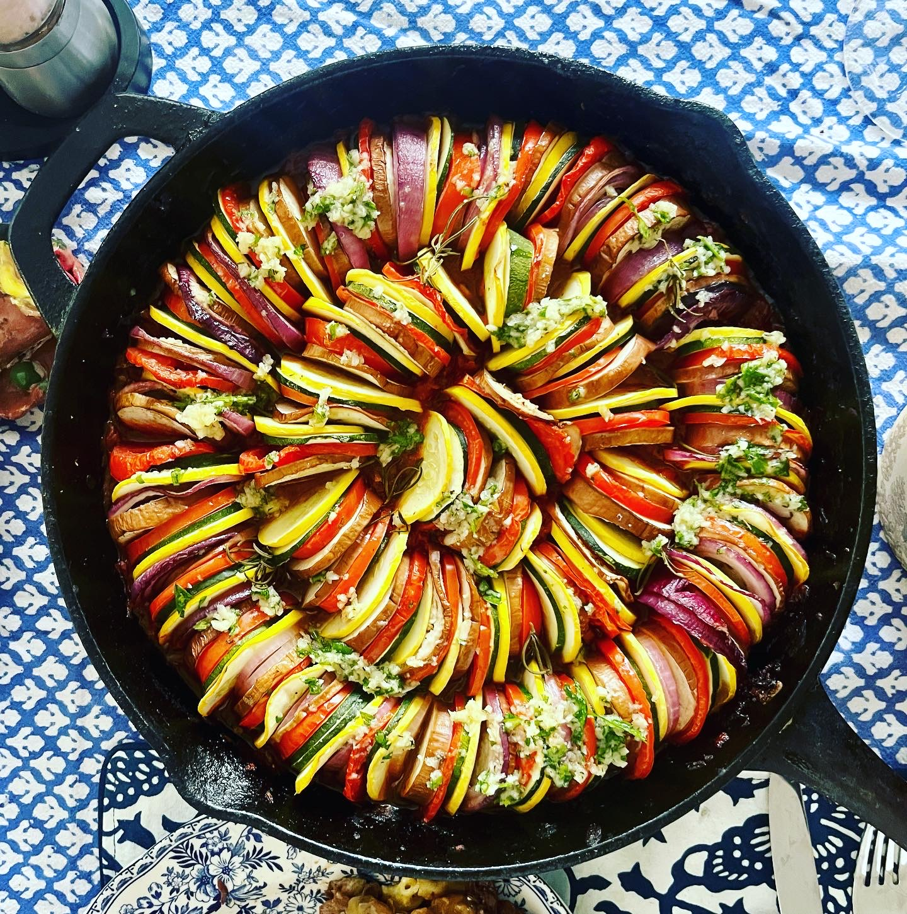
    <div class="food-photo-caption">ratatouille</div>
  </div>
  <div class="food-photo-tile">
    
    <div class="food-photo-caption">tofu steak, roasted red pepper sauce, saffron rice</div>
  </div>
  <div class="food-photo-tile">
    
    <div class="food-photo-caption">greek-style seitan, crispy chickpeas, tzatziki</div>
  </div>
  <div class="food-photo-tile">
    
    <div class="food-photo-caption">birria noodles</div>
  </div>
  <div class="food-photo-tile">
    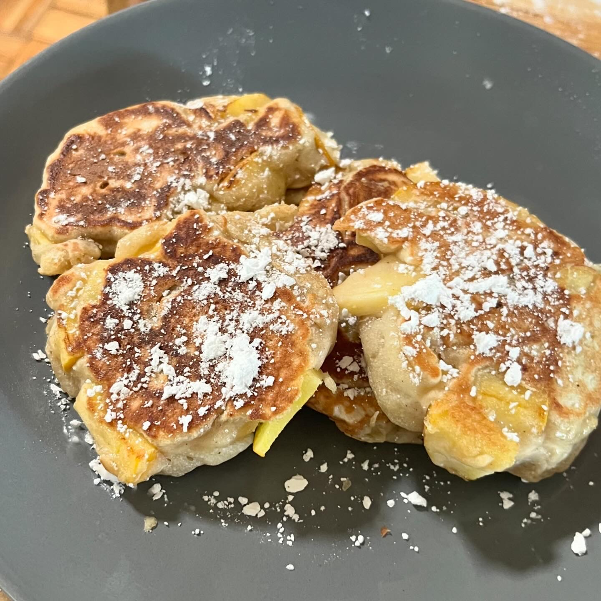
    <div class="food-photo-caption">yeasted apple pancakes</div>
  </div>
  <div class="food-photo-tile">
    
    <div class="food-photo-caption">chana masala, mint chutney</div>
  </div>
  <div class="food-photo-tile">
    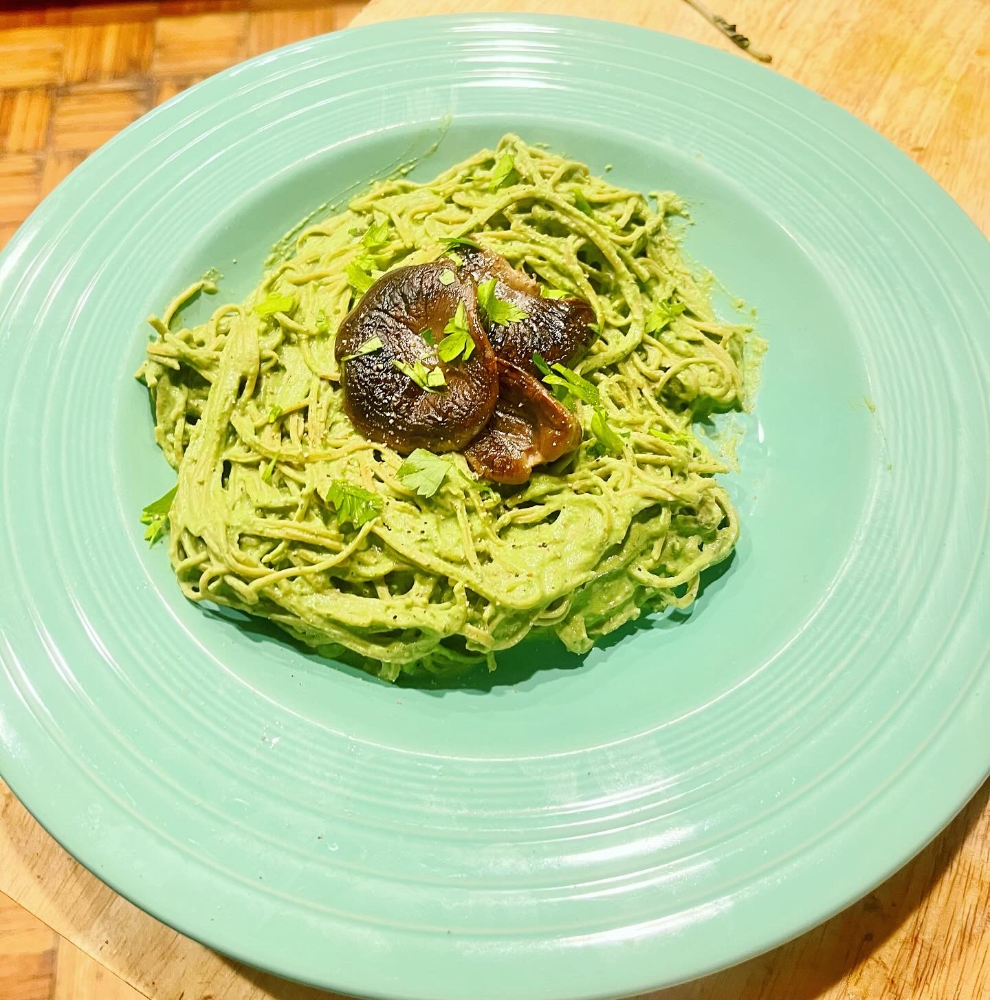
    <div class="food-photo-caption">pesto pasta, king oyster mushrooms</div>
  </div>
  <div class="food-photo-tile">
    
    <div class="food-photo-caption">plant-based steak, butternut squash fusilli, roasted eggplant</div>
  </div>
</div>

<div class="vv-refs">
  <strong>References</strong><br>
  [1] Poore, J. &amp; Nemecek, T. (2018). Reducing food's environmental footprints through producers and consumers. <em>Science</em>, 360(6392), 987–992. <a href="https://doi.org/10.1126/science.aaq0216" target="_blank">doi:10.1126/science.aaq0216</a><br>
  [2] Kim, H. et al. (2019). Plant-based diets are associated with a lower risk of incident cardiovascular disease. <em>J Am Heart Assoc</em>, 8(16):e012865. <a href="https://doi.org/10.1161/JAHA.119.012865" target="_blank">doi:10.1161/JAHA.119.012865</a><br>
  [3] Dinu, M. et al. (2017). Vegetarian, vegan diets and multiple health outcomes: A systematic review with meta-analysis. <em>Crit Rev Food Sci Nutr</em>, 57(17):3640–3649. <a href="https://doi.org/10.1080/10408398.2016.1138447" target="_blank">doi:10.1080/10408398.2016.1138447</a>
</div>
</div>
```

:::
