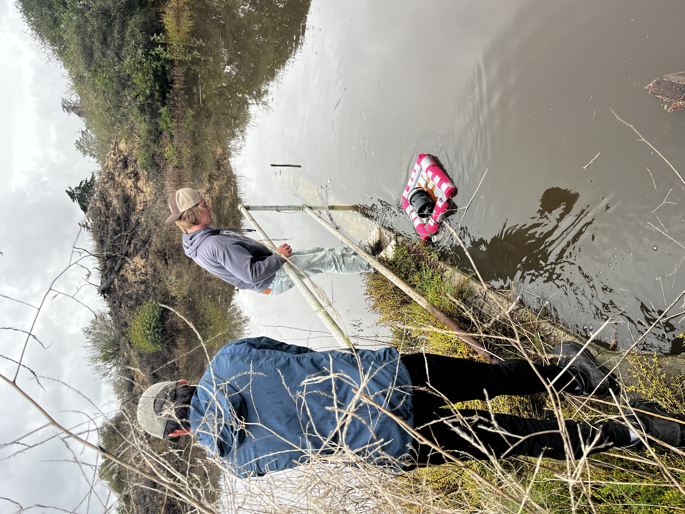

## 1. University of California, Santa Barbara

I will be graduating in 2026 with a B.S. in **Hydrologic Science and Policy** as an Honors student. For two years, I was a recipient of the Bren-Environmental Studies Fellowship where I gained mentorship from Bren graduate students and faculty, learned about career paths in the environmental field, and organized an annual lunch to expose incoming sophomores to the Hydrology major by bringing in guest lecturers to speak about local water issues and projects.

## 2. My Top 10 Classes

Here are some of my favorite classes I've taken throughout my time in undergrad in no particular order.

1.  **Advanced Environmental Impact Analysis**

    -   This course introduced the major components of regulatory compliance under CEQA, using an internship style approach to environmental review. Over the quarter, I developed a full Environmental Impact Report for a hypothetical mixed-use faculty housing project on Campus Point. My work included preparing the Water Resources/Hydrology section, writing the project description, outlining the environmental setting, assessing potential impacts, proposing mitigation measures, evaluating off-site alternatives, and drafting a Project Application Response Letter. 
    
2. **UC Water Academy 2025**

    -   This optional remote course brought professors and professionals in the water field to give lectures on their work, spanning topics like water rights in California, Colorado River allocation, the State Water Project, water use in agriculture, flood managed aquifer recharge. At the end, I presented a two-page infographic to the class about the big players in groundwater overdraft of my local aquifer, the role of SGMA, and next steps for the average person. 
    
3.  **Advanced Groundwater Analysis**

    -   In this class, I learned first principles of subsurface flow. I was introduced to groundwater modeling, remediation, and applied groundwater management in California. Additionally, we analyzed publicly available depth-to-groundwater well data, created contour maps, and delineated watersheds using QGIS.
    
    
4.  **Freshwater Ecology: Sensors to Satellites**

    -   In this course, I built a custom water-quality sensor using the Arduino IDE to measure pH and temperature in the Devereux Slough. I learned to program Arduino microcontrollers, solder and assemble hardware, deploy sensors in the field, and wrangle water quality data. The class also introduced workflows for cleaning sensor data and integrating remote sensing observations into a final report. See picture below of my group deploying our sensor!
    
5.  **GIS For Environmental Applications**

    -  In learning GIS, I gained skills in spatial analysis, cartography, projections, vector and raster data, ArcPy, geoprocessing tools, and map design. I used ArcGIS Pro to build maps, analyze spatial patterns, and solve environmental problems.
        
6.  **Soils Science**

    -   I studied the physical and chemical properties of soils, with coursework covering soil physics, chemistry, hydrology, classification and identification, soil biology, formation and weathering processes. I enjoyed learning how agricultural practices influence soil health.
    
    
7.  **Water Quality**

    -   This course introduced the chemical, physical, and biological processes that oversee water quality in natural and urban systems. We analyzed contaminants, federal water quality standards, treatment technologies, remediation techniques, and regulatory frameworks such as the Clean Water Act and Safe Drinking Water Act.
    
    
8.  **Modern Logic**

    -   I took this course to gain a foundational background in analytical reasoning and formal logic. Coursework included argument structure, symbolic representation, validity, and proof techniques. Breaking down arguments into core building blocks helped strengthen my technical writing.
    
    
9.  **Fluvial Geomorphology**

    -   Technical topics covered sediment deposition, stream order classification, water infrastructure including dams, levees, and embankments. Labs included hydrologic flow modeling, QGIS watershed delineation, and a cartography workshop. My favorite aspect of this class was the field work in Mission Creek, where we conducted pebble counts, classified stream orders, and analyzed the urban channelization and its role in flood control.
    
    
    
10.  **Water Supply and Demand**

    -   This class strengthened my fundamental understanding of the management of water resources, covering surface water processes, groundwater flow, and water use in energy and agriculture. I used Excel to build rating curves and hydrographs from USGS stream gauge data.
    
    

Classifying sediment size distributions in Mission Creek for <em>ES 144: Fluvial Geomorphology</em>.

Deploying our homemade water quality sensor to measure pH and temperature in the Devereux Slough for <em>EEMB 192: Freshwater Ecology</em>.

