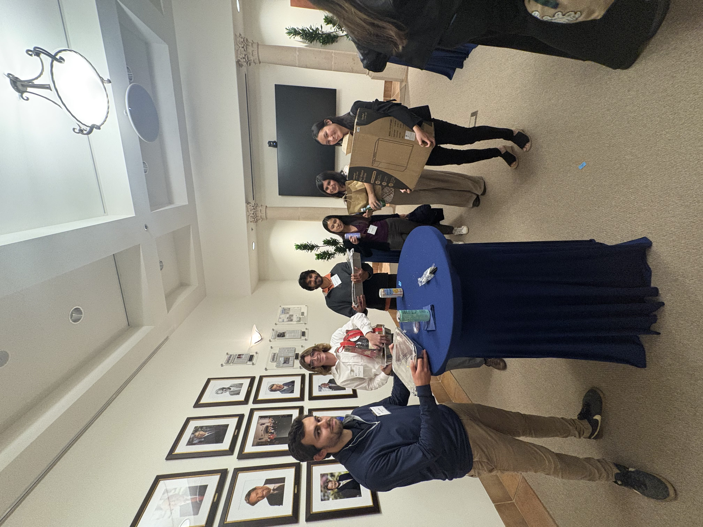
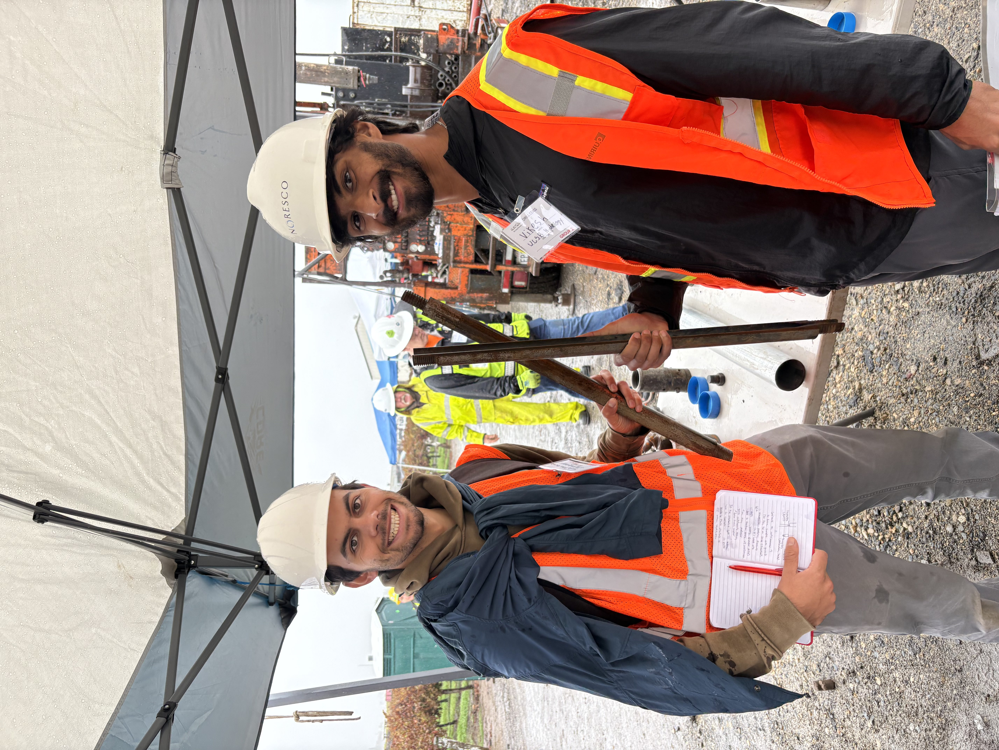
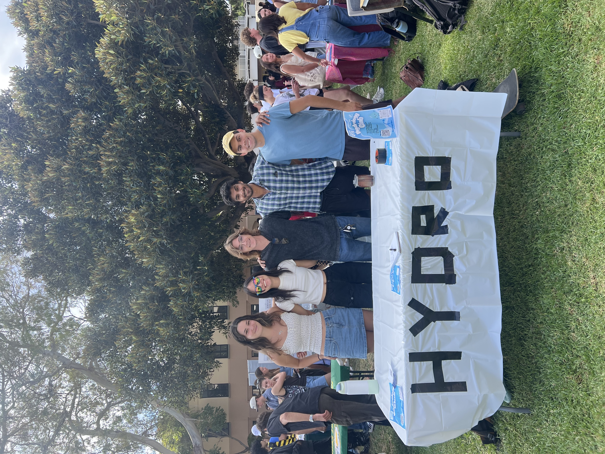
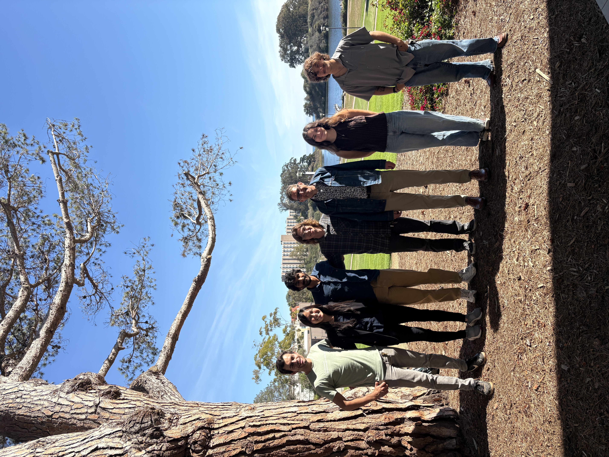
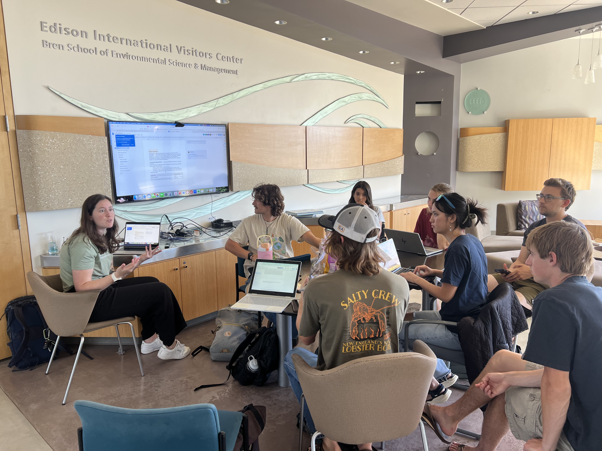

## Hydrology Club

The UCSB Hydrology Club, founded in 2023, works to engage students with local water issues, introduce career pathways in hydrology and water resources, connect students with guest speakers, and organize field trips that apply classroom concepts to the real world. Although Hydrologic Science & Policy is a small major (~20 students compared to ~1,100 in Environmental Studies), interest in water is steadily growing across campus.

As Outreach Coordinator, I focus on expanding awareness of hydrology and making the field more accessible to students who may not have considered water-related careers. Many communities that are most negatively impacted by water management decisions are also the least represented within the water sector. Because hydrology is a small major, a lot of students never realize the opportunities available in water until late in their academic careers. I see outreach as a chance to lower that barrier, especially for students who might not already have connections to environmental fields. Especially in a time where environmental challenges are increasingly complex, building a strong sense of community is essential for supporting the next generation of water professionals.

One of the initiatives I led was a networking workshop for the Hydrology Club in preparation for the Groundwater Resources Association Central Coast Branch Mixer. The workshop helped members strengthen professional skills, feel more confident entering industry spaces, and engage meaningfully with experienced consultants, attorneys, and government officials from across the region.

The UCSB Hydrology Club was the first group of undergraduates to attend a GRA Central Coast Branch meeting.

Holding a SPS pipe at the 2025 Ray Taber Drill Day at CSU Fresno.

Talking and tabling at Club Rush. 

Post-lunch with 2025 Darcy Lecturer Grant Ferguson just before his talk

 Grant application workshop requesting over $7,000 to fund the first comprehensive point-of-use water quality study in Isla Vista history, led entirely by students.

