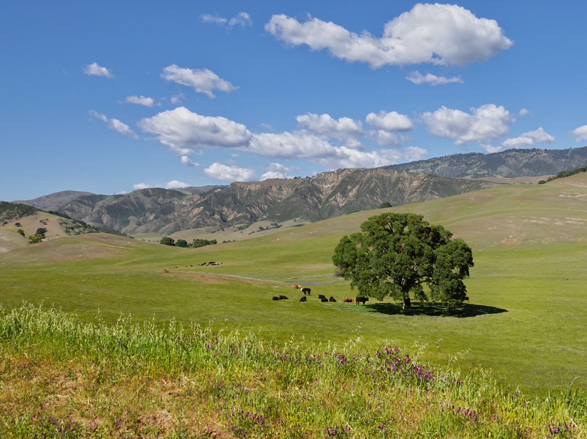
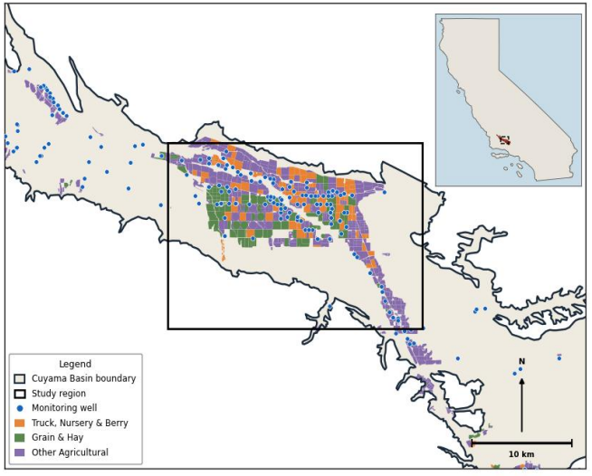
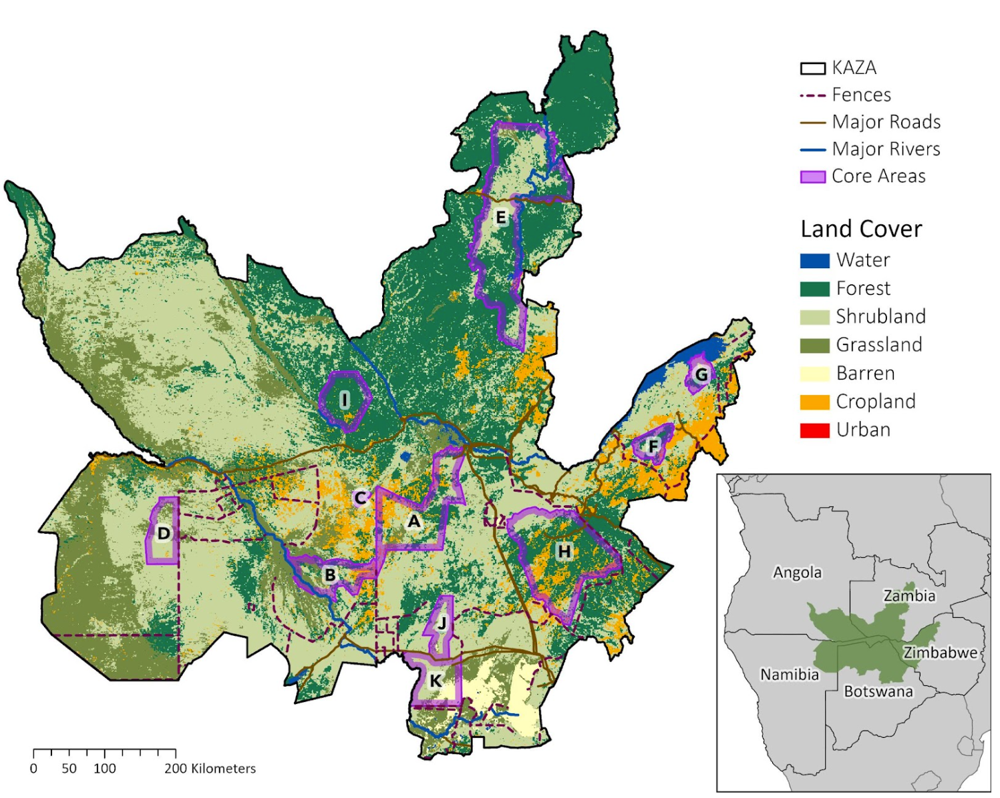
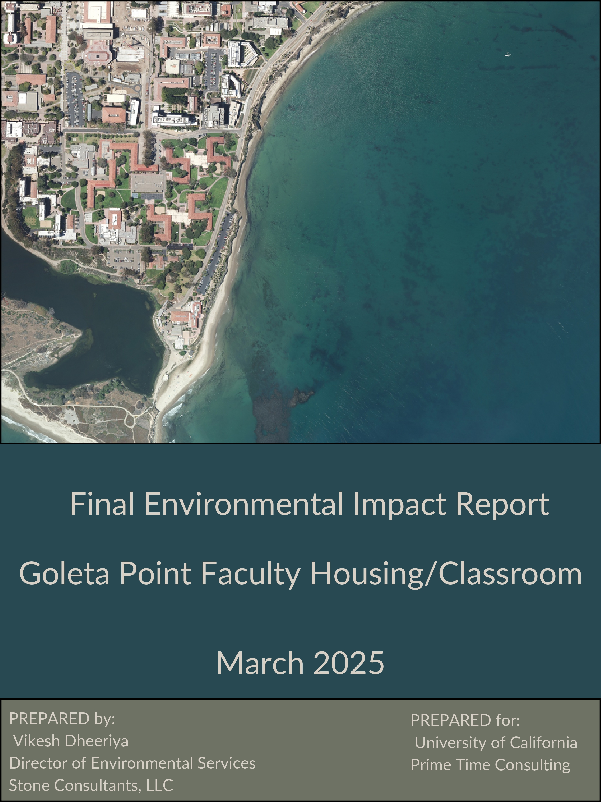
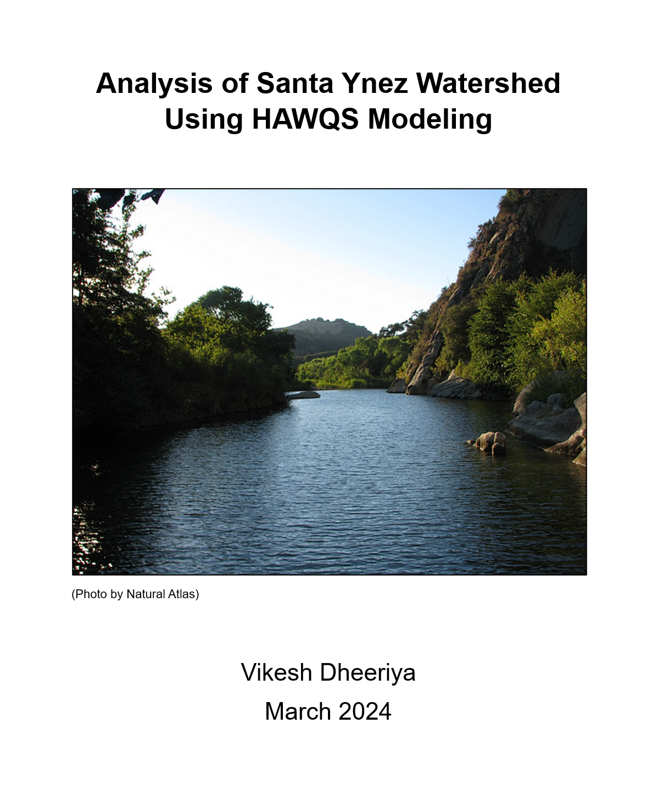

```{=html}
<div class="portfolio-header">
<h1>Portfolio</h1>
</div>

<div class="portfolio-grid">

<a href="projects/above-ground-biomass.html" class="project-card-link">
<div class="project-card">

<div class="project-card-body">
<div class="project-card-title">Predicting Aboveground Biomass in California's Grasslands</div>
<p class="project-card-desc">Applying multi-sensor spectral data and machine learning to predict grassland aboveground biomass across the U.S.</p>
</div>
</div>
</a>

<a href="projects/cuyama-valley.html" class="project-card-link">
<div class="project-card">

<div class="project-card-body">
<div class="project-card-title">OpenET & Groundwater Depletion in the Cuyama Valley</div>
<p class="project-card-desc">Satellite ET analysis linking crop water demand to aquifer depletion in Cuyama Valley.</p>
</div>
</div>
</a>

<a href="projects/elephant-connectivity.html" class="project-card-link">
<div class="project-card">

<div class="project-card-body">
<div class="project-card-title">Projecting Seasonal African Elephant Connectivity under Future Climate and Development Scenarios</div>
<p class="project-card-desc">Multi-scenario connectivity modeling across KAZA assessing climate and land-use threats to elephant corridors.</p>
</div>
</div>
</a>

<a href="projects/eir-analysis.html" class="project-card-link">
<div class="project-card">

<div class="project-card-body">
<div class="project-card-title">Environmental Impact Report</div>
<p class="project-card-desc">Full CEQA hydrology and water resources impact assessment for a proposed campus development.</p>
</div>
</div>
</a>

<a href="projects/04-santaynez/index.html" class="project-card-link">
<div class="project-card">

<div class="project-card-body">
<div class="project-card-title">Santa Ynez Watershed Hydrologic Modeling</div>
<p class="project-card-desc">Watershed hydrologic modeling of the Santa Ynez River under RCP 4.5 and 8.5 climate scenarios.</p>
</div>
</div>
</a>

</div>
```
