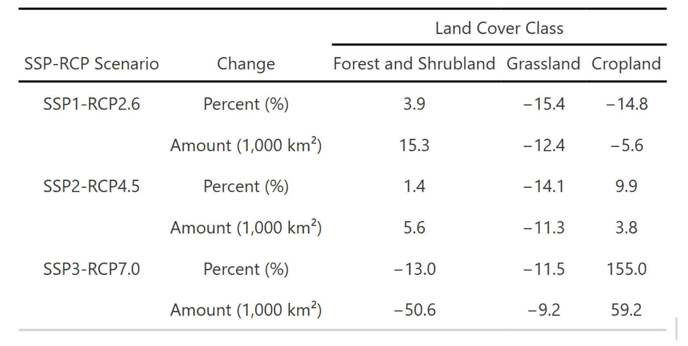

# Overview

Seasonal movement is fundamental to African savanna elephants. During the wet season, when ephemeral surface water is abundant, elephants range widely across the landscape. In the dry season, they contract tightly around perennial water sources. As climate change intensifies aridity and human land conversion accelerates, these seasonal dynamics are expected to shift in ways that may fragment movement corridors and isolate protected populations.

This project falls under the *Spatial planning for climate change: Land use for conservation, agriculture, and energy (SPARCLE)* program, a collaborative research effort with emLab & Conservation International. I helped develop a **seasonal, multi-scenario connectivity modeling framework** to anticipate how elephant movement linkages in the Kavango–Zambezi Transfrontier Conservation Area (KAZA) may change through mid-century. Our analysis integrates future land-cover projections, surface water projections, resistance surface development, and least-cost path (LCP) connectivity modeling across 11 protected core areas.

A central contribution of my work was building **ephemeral waterhole (EWH) frequency layers** across KAZA, a key ecological predictor of elephant movement. I then projected how EWH availability may decline under future climate scenarios and integrated these layers into seasonal resistance surfaces to capture how drying trends reshape movement corridors.

Under high-emissions trajectories (SSP3–RCP7.0), we find that cropland expansion and widespread surface-water loss increase movement costs and reduce overlap between baseline and future corridors. Under sustainability-oriented pathways (SSP1–RCP2.6), connectivity remains stable or slightly improves. These results highlight the importance of corridor protection, appropriate land-use planning, and water management interventions.

::: center
{fig-align="center" fig-width="80%"}
:::

# Methods

## Spatial data

We integrated spatial datasets representing landscape structure, human pressures, hydrology, seasonal water availability, and protected-area networks:

-   **Land cover** – Chen et al. (2022) PFT-based global land cover and SSP–RCP projections\
-   **Ephemeral waterholes** – Sentinel-2 EWH frequency layers (2017–2020) built using the Schaffer-Smith et al. (2022) workflow\
-   **Hydrology** – HydroRIVERS v1.0 (flow-order–based river permanence)\
-   **Topography** – USGS Africa DEM (3-arc-second)\
-   **Barriers** – Veterinary fences (Huang et al. 2022; Taylor 2019) and GRIP road network\
-   **Elephant data** – WDPA protected areas and GPS-collar tracks (2010–2020) from the University of Namibia\
-   **Connectivity modeling** – Linkage Mapper v3.1.0 (ArcGIS) for cost-distance and LCP analysis

All resistance-layer construction scripts, EWH workflow scripts, and LCP modeling code are archived in the project repository.

# Ephemeral waterholes

Ephemeral surface water is one of the strongest predictors of elephant movement decisions in KAZA. Elephants can detect and navigate toward waterholes from distances \>4 km (and in some cases \>40 km), and path-selection studies show that access to ephemeral water significantly improves model performance.

## 1. High-resolution waterhole mapping (10 m)

To generate a KAZA-wide EWH frequency map, I:

-   processed Sentinel-2 imagery (2017–2020);\
-   applied the Automated Water Extraction Index (AWEI) with dynamic thresholding;\
-   masked clouds, shadow, and burn scars;\
-   created seasonal composites across 18 time windows.

For each seasonal window, water pixels were classified, summed, and normalized to produce a **0–1 EWH frequency raster** representing how often each pixel held water.

Because the published Schaffer-Smith et al. raster only covered central KAZA, I replicated and extended their workflow to cover the full transboundary region in Google Earth Engine.

## 2. Integrating EWHs into 250 m resistance layers

To merge the 10 m EWH data into the project’s 250 m resistance framework, I:

1.  **Resampled** the EWH frequency raster using nearest-neighbor to preserve discrete values.\
2.  **Filtered** out EWHs occurring \<20% of the year.\
3.  **Binned** remaining pixels into frequency classes (20–40%, 40–80%, 80–100%).\
4.  **Assigned season-specific resistance values:**
    -   **Wet season:** all EWH bins treated as movement attractants (reduced resistance).\
    -   **Dry season:** only high-frequency EWHs remain attractive; low-frequency pixels carry higher resistance.

These steps allowed the resistance surface to meaningfully represent **seasonal water availability**, a core ecological driver of elephant movement.

## 3. Projecting future EWH declines (2035 & 2050)

Drawing on climate projections for Sub-Saharan Africa and empirical work on waterhole persistence (e.g., Cockayne 2021), I applied scenario-specific EWH declines:

-   −15% under **SSP1–RCP2.6**\
-   −20% under **SSP2–RCP4.5**\
-   −25% under **SSP3–RCP7.0**

Reduced frequencies were re-binned and converted into new attractant layers for future resistance surfaces, ensuring that seasonal connectivity models directly reflected **future aridification and loss of ephemeral water**.

## Land Cover Change Analysis

::: center
![**Figure 2.** Projected cropland expansion and land-cover change in KAZA from 2015 to 2050 for SSP3-RCP7.0. (a) Spatial distribution of KAZA’s cropland in 2015 (yellow & blue), areas projected to be converted to cropland by 2050 (dark red) and abandoned cropland (blue). (b) Sankey diagram summarizing decadal land cover trajectories. Vertical nodes indicate the proportion of KAZA occupied by forest and shrubland (green), grassland (blue), and cropland (purple) at each time step. Curved links depict magnitude and direction of land-cover transitions. Barren, water and urban land cover classes were not included because they make up \~1% of KAZA.](cropland.png){fig-align="center" fig-width="80%"}
:::

::: center
{fig-align="center" fig-width="80%"}
:::
