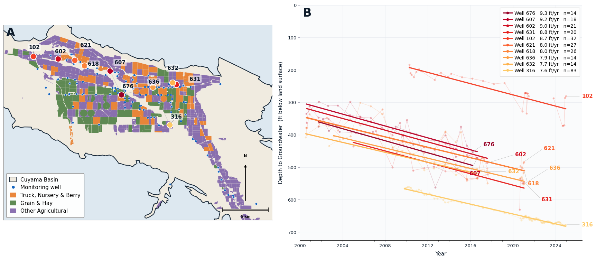
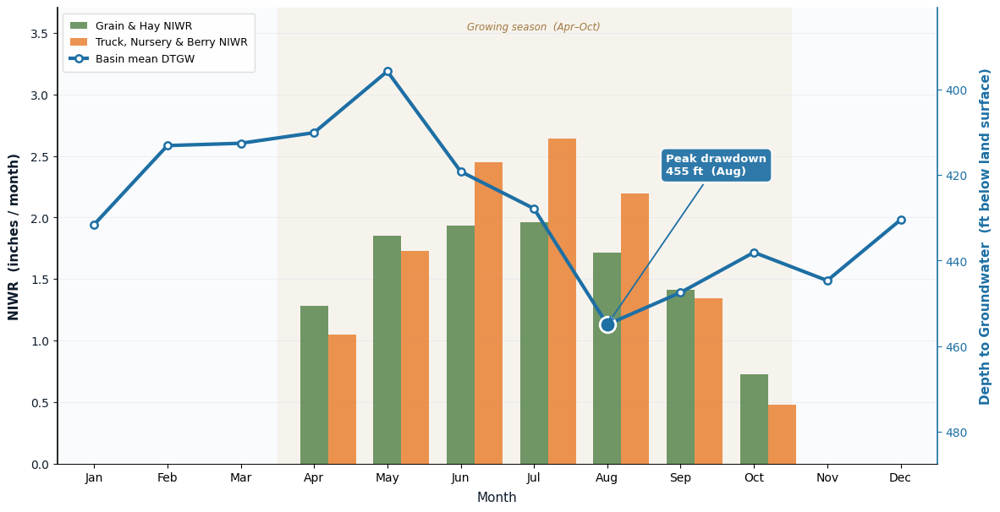

## Crop Irrigation Demand and Accelerating Aquifer Depletion in the Cuyama Valley

*March 2026*

Using the OpenET platform, an ensemble of six satellite-based evapotranspiration models at 30-m resolution derived from Landsat imagery, I analyzed how agricultural water demand by crop type relates to aquifer drawdown in the Cuyama Valley from 2016 to 2024. Crop classifications came from the DWR i15 2024 Provisional Crop Mapping dataset. Net irrigation water requirement (NIWR) was computed as OpenET ET minus GRIDMET precipitation over the April–October growing season.

**Key findings:**

- The ten fastest-declining monitoring wells are deepening at **7.6–9.3 ft/yr**, far exceeding the GSP's 2 ft/yr sustainability threshold
- Truck, Nursery & Berry crops (which include carrots and represent 49% of basin agricultural revenue) peak in ET demand in July, two months later than Grain & Hay crops, sustaining high irrigation demand when the aquifer is already drawn down from earlier-season pumping
- Peak basin groundwater depth reaches **455 ft below land surface in August**, aligning precisely with peak NIWR from Truck, Nursery & Berry crops
- The fastest-depleting wells cluster spatially in the central zone, directly beneath Truck, Nursery & Berry parcels
- A pumping framework that treats all crops equally underestimates the contribution of high-value, water-intensive perennials to overdraft; crop-differentiated pumping allocations may be necessary for the GSP to meet its 2040 targets

```{=html}
<figure style="margin:1.5rem 0;">
  
  <figcaption style="font-size:0.78rem; margin-top:0.4rem;"><strong>Fig. 3.</strong> Spatial distribution of the ten fastest-depleting wells overlaid on the 2024 DWR crop type map (A) and individual well depth-to-groundwater time series with linear trend lines, 2000–2024 (B).</figcaption>
</figure>
<figure style="margin:1.5rem 0;">
  
  <figcaption style="font-size:0.78rem; margin-top:0.4rem;"><strong>Fig. 4.</strong> Mean monthly net irrigation water requirement (NIWR) for Grain & Hay and Truck, Nursery & Berry crops overlaid with basin mean depth to groundwater, 2016–2024. Peak drawdown of 455 ft occurs in August, coinciding with peak Truck, Nursery & Berry demand.</figcaption>
</figure>
```

::: text-center
[📄 View Full Report (PDF)](03-cuyama/Cuyama OpenET.pdf){.btn .btn-primary target="_blank"}
:::

<iframe src="03-cuyama/Cuyama OpenET.pdf" width="100%" height="800px" style="border: none; border-radius: 8px; margin-top: 1rem;">
</iframe>

---

## Arsenic Presence in the Cuyama Groundwater Basin

*March 2026*

Excessive pumping doesn't just affect water quantity, it can also degrade water quality. Overpumping mobilizes naturally occurring arsenic from aquifer sediments into water supplies. The EPA maximum contaminant level (MCL) for arsenic is 10 µg/L due to its carcinogenic risk from long-term exposure.

Using data from California's Groundwater Ambient Monitoring and Assessment (GAMA) program, I mapped arsenic occurrence across the basin and analyzed time series records from the most frequently sampled well (CA 4210009_002_002, 2015–2025). Arsenic concentrations in central Cuyama frequently and substantially exceed the MCL. The areas with the most arsenic contamination are also the ones with the greatest groundwater declines. Despite these exceedances, the Cuyama GSP lacks arsenic sustainability thresholds and recommends sampling only once every five years, a monitoring frequency insufficient to protect local water supplies.

::: text-center
[📄 View Full Report (PDF)](03-cuyama/Cuyama_Valley_SGMA_Set_2_2.pdf){.btn .btn-primary target="_blank"}
:::

<iframe src="03-cuyama/Cuyama_Valley_SGMA_Set_2_2.pdf" width="100%" height="700px" style="border: none; border-radius: 8px; margin-top: 1rem;">
</iframe>

---

## UC Water Academy Infographic

*March 2025*

I developed an infographic for the UC Water Academy presenting the Cuyama groundwater crisis to UC faculty and graduate students. It covers decades of overdraft, the role of large agricultural corporations, and the inequities experienced by small farmers and rural households dependent on the same aquifer.

::: text-center
[📄 View Infographic (PDF)](03-cuyama/carrot.pdf){.btn .btn-primary target="_blank"}
:::

<iframe src="03-cuyama/carrot.pdf" width="100%" height="750px" style="border: none; border-radius: 8px; margin-top: 1rem;">
</iframe>
