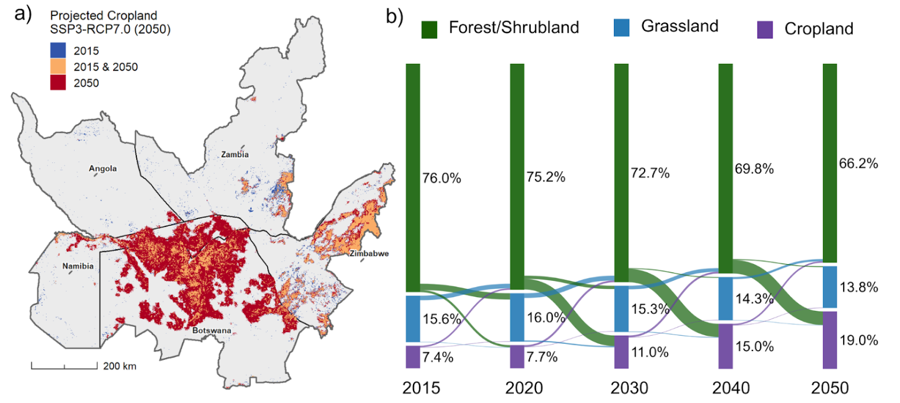

  Manuscript in Review
  Environmental Markets Lab &amp; Conservation International &nbsp;·&nbsp; 2024–2025

## Overview

Seasonal movement is essential to African savanna elephants. In the wet season, elephants range widely as ephemeral water becomes available; in the dry season, movement contracts around permanent water. Climate change and rapid land conversion are likely to alter these patterns and further isolate protected populations.

This project falls under the Spatial Planning for Climate Change: Land Use for Conservation, Agriculture, and Energy (SPARCLE) program, a collaborative research effort with emLab & Conservation International. I worked with Bren MESM students and CI scientists to build a seasonal, multi-scenario connectivity model to assess how elephant movement across KAZA may change by mid-century, integrating future land cover, surface water projections, resistance surfaces, and least-cost path connectivity across 11 protected areas.

A key contribution of my work was developing ephemeral waterhole frequency layers and projecting their decline under future climate scenarios. These layers were incorporated into seasonal resistance surfaces to capture how drying trends may reshape movement pathways. Under high emissions (SSP3–RCP7.0), cropland expansion increases movement costs and reduces corridor overlap, while under low-emissions pathways (SSP1–RCP2.6), connectivity remains largely stable.

## Methods

### Spatial data

- **Land cover**: Chen et al. (2022) PFT-based global land cover and SSP–RCP projections
- **Ephemeral waterholes**: Sentinel-2 EWH frequency layers (2017–2020) using the Schaffer-Smith et al. (2022) workflow
- **Hydrology**: HydroRIVERS v1.0 (flow-order-based river permanence)
- **Topography**: USGS Africa DEM (3-arc-second)
- **Barriers**: Veterinary fences and GRIP road network
- **Elephant data**: WDPA protected areas and GPS-collar tracks (2010–2020), University of Namibia
- **Connectivity modeling**: Linkage Mapper v3.1.0 (ArcGIS)

::: {style="text-align:center; margin:1.5rem 0;"}
{fig-align="center" style="max-width:90%;"}
:::

## Land Cover Change

::: {style="text-align:center; margin:1.5rem 0;"}
{fig-align="center" style="max-width:90%;"}
:::

## Findings

Future scenarios with rapid warming and high land conversion decrease elephant connectivity and increase isolation risk for core habitats, with the greatest declines occurring during the wet season. These impacts are most evident in central KAZA, affecting corridors between some of the region's largest protected areas. Under lower-emissions pathways, connectivity remains largely stable, highlighting the conservation importance of climate mitigation alongside spatial planning.

The workflow provides a transferable approach for effective corridor planning and protected-area network design under global change. This methodology explicitly accounts for seasonality and future scenario uncertainty rather than treating connectivity as static.
