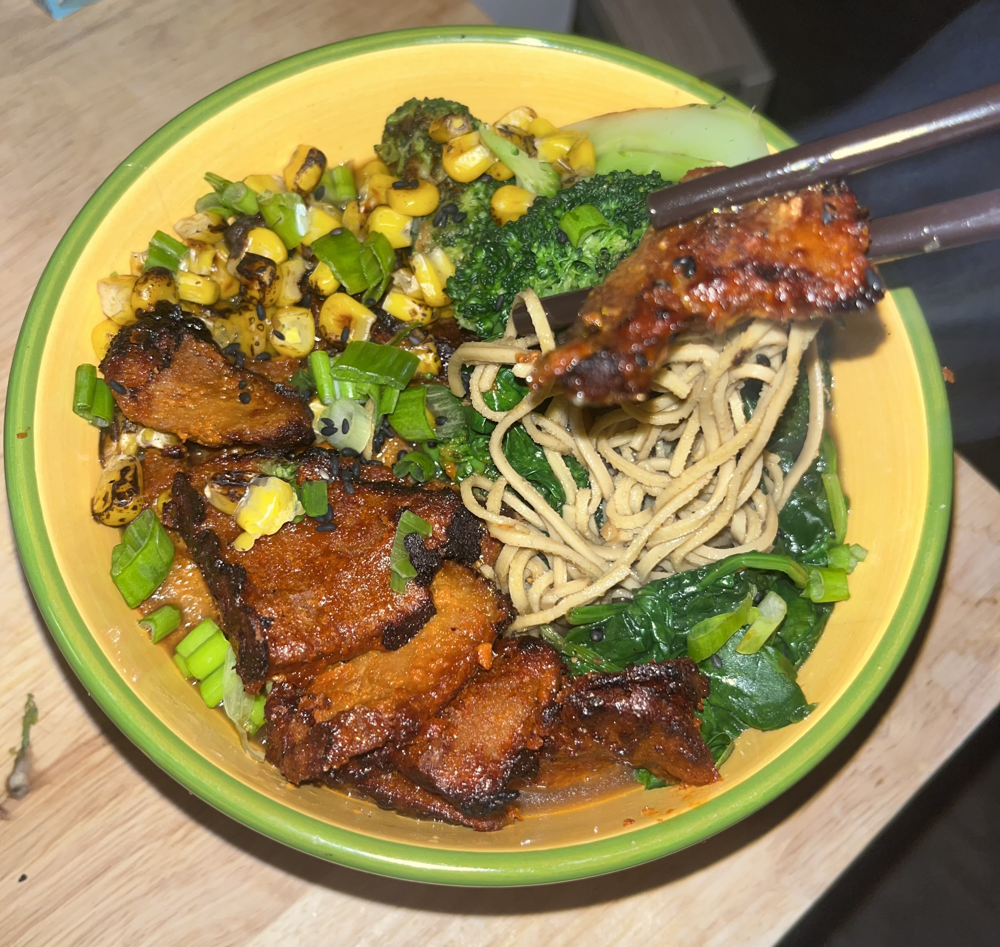
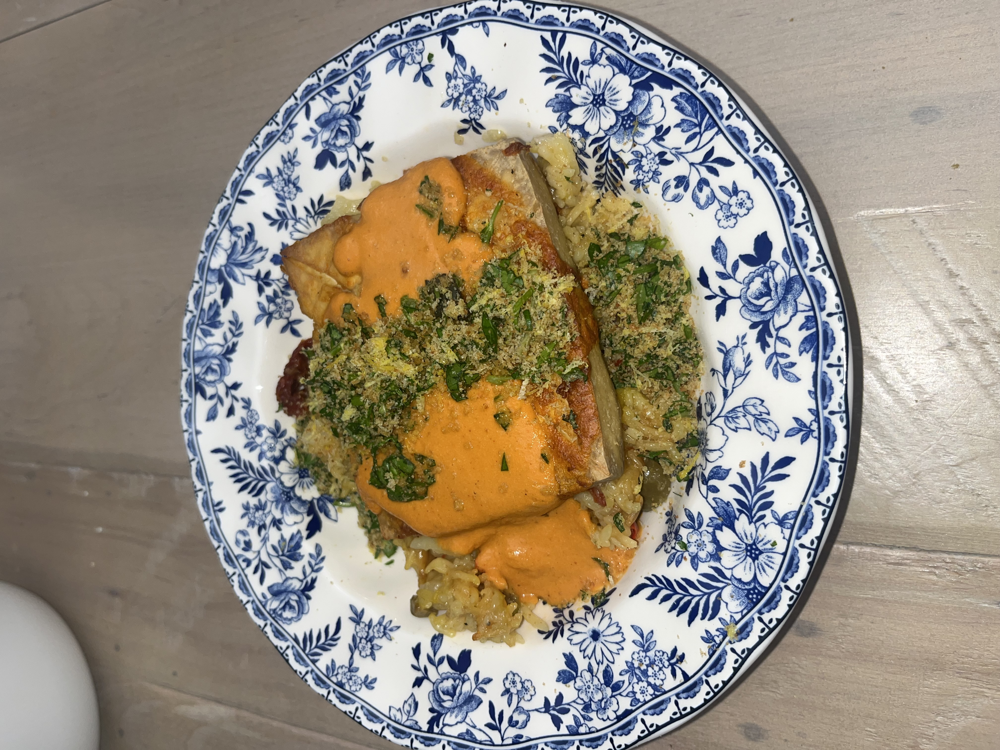
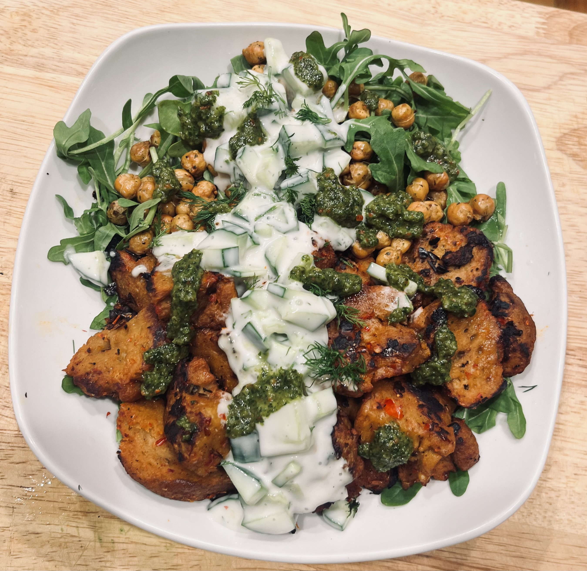
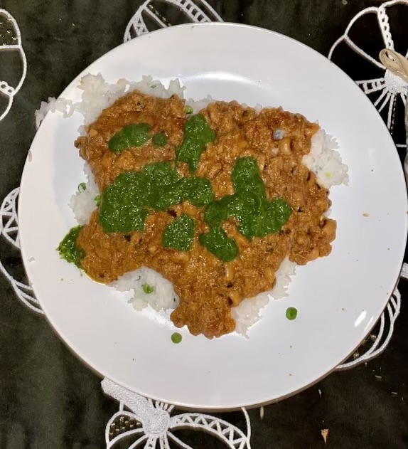
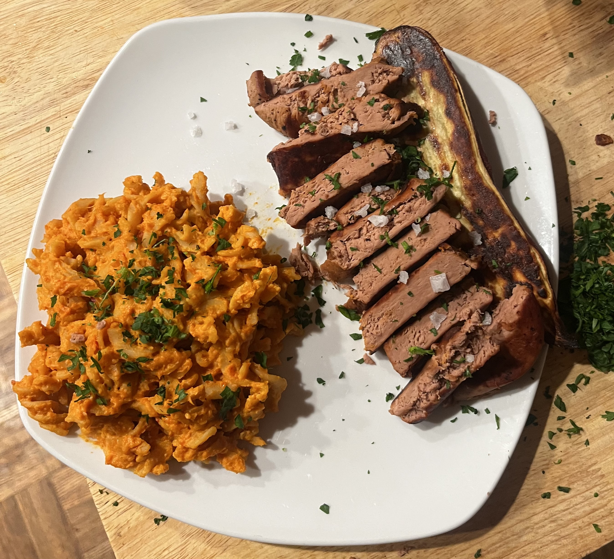

  Personal Project
  Ongoing

## Overview

Urban gardening and cooking project exploring sustainable growing practices, soil science, and plant-based food production. Growing vegetables connects directly to what I study: soil dynamics, water use, and how land supports biological systems at a very tangible scale.

## Focus Areas

- Sustainable and low-input growing practices
- Soil amendment and compost use
- Seasonal crop planning and rotation
- Water efficiency and conservation in small-scale horticulture

  <figure><figcaption>shoyu ramen, seitan chashu</figcaption></figure>
  <figure><figcaption>tofu steak, roasted red pepper sauce, saffron rice</figcaption></figure>
  <figure><figcaption>greek-style seitan, crispy chickpeas</figcaption></figure>
  <figure><figcaption>chana masala, mint chutney</figcaption></figure>
  <figure><figcaption>plant-based steak, butternut squash fusilli</figcaption></figure>

