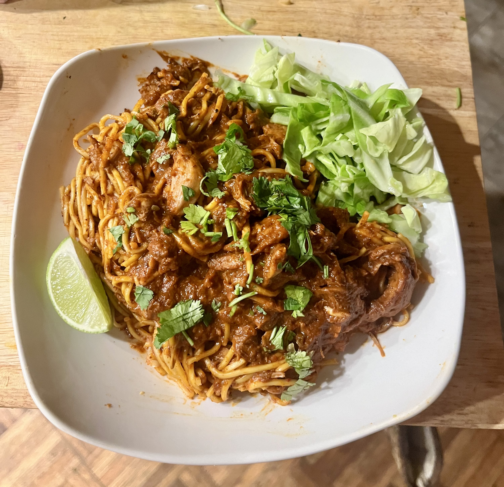

<h1 class="display-4 text-center mb-4" style="color:var(--green-main);">viks veggies</h1>

shoyu ramen, seitan chashu

ratatouille

tofu steak, roasted red pepper sauce, saffron rice

greek-style seitan, crispy chickpeas, tzatzski tz

birria noodles

yeasted apple pancakes

chana masala, mint chutney

pesto pasta, king oyster mushrooms

plant-based steak, butternut squash fusilli, roasted eggplant

